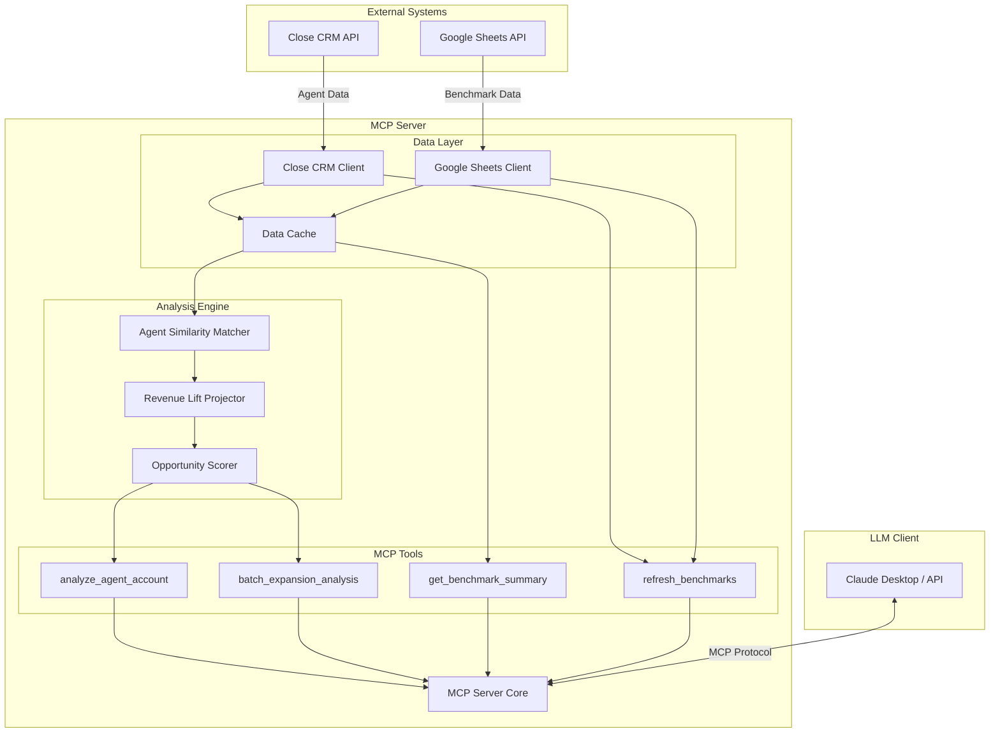
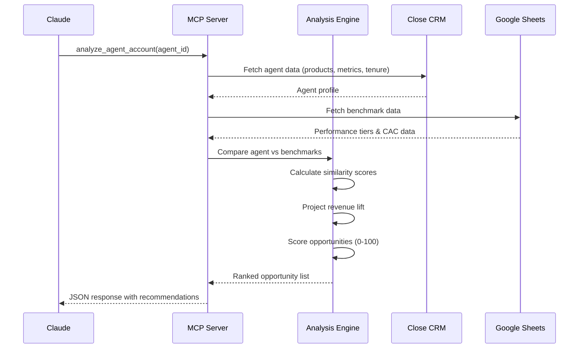

# Insurance Agent Account Expansion Analyzer - Development Plan

## Executive Summary

### What This Tool Does
The Insurance Agent Account Expansion Analyzer is an MCP (Model Context Protocol) server that identifies revenue growth opportunities for insurance agents by comparing their current product mix and performance metrics against benchmark data from top performers. The tool integrates Close CRM for agent account data and Google Sheets for benchmark storage, providing actionable recommendations with projected revenue lift.

### Business Value
- **Revenue Growth**: Identifies cross-sell and upsell opportunities by showing agents what similar high performers sell
- **Data-Driven Decisions**: Replaces gut feelings with concrete benchmarks from 5 performance tiers (Top 10%, Top 25%, Average, Below Average, Bottom 10%)
- **Prioritized Action**: Scores opportunities 0-100 based on confidence, potential lift, and agent readiness
- **Time Savings**: Automates analysis that would take hours manually, surfacing insights in seconds

**Example Output**: "Agent currently sells Home-only with $45K annual premium. Similar agents in Top 25% tier who added Auto see average 35% revenue lift ($15.8K). Contact rate 50% suggests strong client relationships—high confidence opportunity."

---

## Architecture Overview

### System Diagram



### Data Flow



### Component Responsibilities

**Close CRM Client**
- Authenticate with Close API using API key
- Fetch agent account data (custom fields for products, revenue, tenure, region)
- Fetch opportunity data and custom product line fields
- Handle rate limiting (600 requests/min) and retries
- Cache responses for 5 minutes to reduce API calls

**Google Sheets Client**
- Authenticate using service account credentials
- Read benchmark data from structured sheets (Agent Tiers, CAC by Product, Conversion Rates)
- Write updated benchmarks if refresh_benchmarks is called
- Handle batch read/write operations for efficiency

**Analysis Engine**
- **Agent Similarity Matcher**: Cosine similarity on product vectors, tenure bands, performance tier
- **Revenue Lift Projector**: Median lift from similar agents who added product X
- **Opportunity Scorer**: Weighted scoring (50% lift potential, 30% confidence, 20% agent readiness)

**MCP Server Core**
- Implement MCP protocol (stdio transport)
- Route tool calls to appropriate handlers
- Validate input parameters
- Format responses per MCP specification

---

## Data Models

### Agent Schema

**Source**: Close CRM Custom Fields + Lead Data

```python
class Agent:
    # Identity
    id: str                          # Close CRM lead_id or contact_id
    name: str
    email: str
    phone: str

    # Business Profile
    current_products: list[str]      # ["Auto", "Home", "Life"]
    annual_premium_volume: float     # Total book size in $
    tenure_months: int               # Months as agent
    region: str                      # Geographic region
    agency_type: str                 # "Independent", "Captive", "MGA"

    # Performance Metrics (from Close opportunities/custom fields)
    contact_rate: float              # % of leads contacted (0-100)
    quote_rate: float                # % of contacts quoted (0-100)
    close_rate: float                # % of quotes closed (0-100)
    monthly_lead_volume: int         # Avg leads per month
    cost_per_acquisition: float      # CAC in $

    # Derived Fields
    performance_tier: str            # "Top 10%", "Top 25%", "Average", etc.
    product_vector: list[float]      # One-hot encoding of products for similarity

    # Metadata
    last_updated: datetime
    data_completeness_score: float   # 0-100, how complete is profile
```

**Close CRM Field Mapping**:
```python
CLOSE_FIELD_MAP = {
    "current_products": "custom.cf_product_lines",      # Multi-select custom field
    "annual_premium_volume": "custom.cf_book_size",
    "tenure_months": "custom.cf_agent_tenure",
    "contact_rate": "custom.cf_contact_rate",
    "quote_rate": "custom.cf_quote_rate",
    "close_rate": "custom.cf_close_rate",
    "monthly_lead_volume": "custom.cf_monthly_leads",
    "cost_per_acquisition": "custom.cf_cac",
}
```

---

### Benchmark Schema

**Source**: Google Sheets (insurance_benchmarks_summary.csv structure)

```python
class BenchmarkTier:
    tier_name: str                   # "Top 10%", "Top 25%", "Average", etc.
    contact_rate_range: tuple[float, float]   # (55, 70) for Top 10%
    quote_rate_range: tuple[float, float]     # (35, 50)
    close_rate_range: tuple[float, float]     # (25, 40)
    cac_range: tuple[float, float]            # (25, 60)
    monthly_lead_volume_range: tuple[int, int]  # (150, 300)

class ProductBenchmark:
    product: str                     # "Auto", "Home", "Life", etc.
    organic_cac: float               # From Focus Digital 2024
    inorganic_cac: float
    blended_cac: float
    avg_annual_premium: float        # Industry avg per policy
    penetration_by_tier: dict[str, float]  # {"Top 10%": 0.85, "Average": 0.45}

class CrossSellPattern:
    primary_product: str             # "Home"
    added_product: str               # "Auto"
    avg_revenue_lift_pct: float      # 35.0 means 35% increase
    adoption_rate: float             # What % of similar agents do this
    avg_time_to_add_months: int      # How long after starting
    tier_distribution: dict[str, int]  # Which tiers do this most

class BenchmarkData:
    tiers: list[BenchmarkTier]
    products: list[ProductBenchmark]
    cross_sell_patterns: list[CrossSellPattern]
    conversion_rates: dict[str, float]  # Industry averages
    last_updated: datetime
    source: str                      # "Focus Digital 2024, Unbounce, etc."
```

**Google Sheets Structure**:

**Sheet 1: "Agent_Tiers"**
| Tier | Contact_Rate_Min | Contact_Rate_Max | Quote_Rate_Min | Quote_Rate_Max | Close_Rate_Min | Close_Rate_Max | CAC_Min | CAC_Max | Lead_Volume_Min | Lead_Volume_Max |
|------|------------------|------------------|----------------|----------------|----------------|----------------|---------|---------|-----------------|-----------------|
| Top 10% | 55 | 70 | 35 | 50 | 25 | 40 | 25 | 60 | 150 | 300 |
| Top 25% | 45 | 55 | 25 | 35 | 18 | 25 | 50 | 90 | 100 | 150 |
| Average | 30 | 45 | 15 | 25 | 12 | 18 | 80 | 130 | 50 | 100 |

**Sheet 2: "Product_CAC"**
| Product | Organic_CAC | Inorganic_CAC | Blended_CAC | Avg_Annual_Premium | Source |
|---------|-------------|---------------|-------------|-------------------|--------|
| Auto | 203.52 | 305.28 | 244.22 | 950 | Focus Digital 2024 |
| Home | 140.72 | 211.08 | 168.86 | 1200 | Focus Digital 2024 |

**Sheet 3: "Cross_Sell_Patterns"** (populated from CRM analysis)
| Primary_Product | Added_Product | Avg_Lift_Pct | Adoption_Rate | Avg_Time_Months | Tier |
|----------------|---------------|--------------|---------------|-----------------|------|
| Home | Auto | 35.2 | 0.68 | 6 | Top 25% |
| Auto | Home | 28.5 | 0.54 | 8 | Top 25% |

---

### Opportunity Schema

**Output Format**: What the MCP tool returns

```python
class ExpansionOpportunity:
    # Identification
    opportunity_id: str              # Generated UUID
    agent_id: str
    agent_name: str

    # Recommendation
    opportunity_type: str            # "Add Product", "Improve Conversion", "Increase Volume"
    message: str                     # Human-readable description
    recommended_product: str | None  # "Auto" if product add

    # Projections
    projected_revenue_lift: float    # Dollar amount
    projected_lift_pct: float        # Percentage increase
    confidence_level: str            # "High", "Medium", "Low"
    confidence_score: float          # 0-1 raw score

    # Scoring
    priority_score: int              # 0-100 composite score
    rank: int                        # Ranking in batch analysis

    # Evidence
    similar_agent_count: int         # How many similar agents found
    similar_agent_avg_revenue: float # What they earn
    agent_current_tier: str          # "Average"
    agent_target_tier: str           # "Top 25%"

    # Readiness Signals
    readiness_indicators: list[str]  # ["Strong contact rate", "High tenure"]
    barriers: list[str]              # ["Low lead volume", "New agent"]

    # Metadata
    generated_at: datetime
    expires_at: datetime             # Stale after 30 days
```

**Example Opportunity**:
```json
{
  "opportunity_id": "opp_a1b2c3",
  "agent_id": "lead_xyz789",
  "agent_name": "John Smith",
  "opportunity_type": "Add Product",
  "message": "Agent currently sells Home-only with $45K annual premium. Similar Top 25% agents who added Auto see average 35% revenue lift ($15.8K). Agent has strong contact rate (50%) and 2+ years tenure—high confidence opportunity.",
  "recommended_product": "Auto",
  "projected_revenue_lift": 15800.0,
  "projected_lift_pct": 35.1,
  "confidence_level": "High",
  "confidence_score": 0.82,
  "priority_score": 87,
  "rank": 1,
  "similar_agent_count": 47,
  "similar_agent_avg_revenue": 60800.0,
  "agent_current_tier": "Average",
  "agent_target_tier": "Top 25%",
  "readiness_indicators": [
    "Contact rate 50% (above tier average)",
    "Tenure 24 months (established relationships)",
    "Active in high-penetration region"
  ],
  "barriers": [
    "Monthly lead volume 55 (below Top 25% threshold of 100)"
  ],
  "generated_at": "2025-12-10T14:30:00Z",
  "expires_at": "2026-01-09T14:30:00Z"
}
```

---

## API Specifications

### Close CRM API Integration

**Base URL**: `https://api.close.com/api/v1/`

**Authentication**: API Key in header `Authorization: Bearer {api_key}`

**Rate Limit**: 600 requests/min (10 req/sec)

#### Endpoints Used

**1. Get Lead/Contact (Agent Profile)**
```http
GET /lead/{lead_id}/
```
Response extracts:
- `id`, `display_name`, `contacts[0].emails[0].email`, `contacts[0].phones[0].phone`
- `custom.cf_product_lines`, `custom.cf_book_size`, `custom.cf_agent_tenure`
- `custom.cf_contact_rate`, `custom.cf_quote_rate`, `custom.cf_close_rate`

**2. Search Leads (Batch Analysis)**
```http
POST /data/search/
Body: {
  "query": "status:active AND custom.cf_agent_tier:*",
  "limit": 100,
  "_fields": ["id", "display_name", "custom"]
}
```

**3. Get Opportunities (Product Revenue)**
```http
GET /opportunity/?lead_id={lead_id}
```
Extract: `value`, `custom.cf_product_line` to calculate product mix

**Error Handling Strategy**:
- 429 Rate Limit: Exponential backoff (1s, 2s, 4s) with max 3 retries
- 401 Unauthorized: Raise config error, prompt for valid API key
- 404 Not Found: Log warning, skip agent in batch analysis
- 500 Server Error: Retry once after 5s, then fail gracefully with partial results

**Caching Strategy**:
- TTL: 5 minutes for agent data (allow some staleness for performance)
- Cache Key: `close_lead_{lead_id}_{timestamp_5min_bucket}`
- Cache Storage: In-memory dict with LRU eviction (max 1000 entries)

---

### Google Sheets API Integration

**Authentication**: Service Account JSON key file

**Scope**: `https://www.googleapis.com/auth/spreadsheets`

**Sheet ID**: Configured via environment variable `BENCHMARK_SHEET_ID`

#### Sheet Structure

**Expected Sheets** (tab names):
1. `Agent_Tiers` - Performance tier definitions
2. `Product_CAC` - Acquisition costs by product
3. `Cross_Sell_Patterns` - Historical cross-sell lift data
4. `Conversion_Rates` - Industry benchmark conversion rates

#### Operations

**1. Read All Benchmarks**
```python
# Batch read all sheets at once
ranges = [
    "Agent_Tiers!A1:K10",
    "Product_CAC!A1:F20",
    "Cross_Sell_Patterns!A1:G100",
    "Conversion_Rates!A1:D50"
]
result = sheets_service.spreadsheets().values().batchGet(
    spreadsheetId=SHEET_ID,
    ranges=ranges
).execute()
```

**2. Write Cross-Sell Pattern (refresh_benchmarks)**
```python
# Append new row to Cross_Sell_Patterns
values = [[
    "Home", "Auto", 35.2, 0.68, 6, "Top 25%", "2025-12-10"
]]
sheets_service.spreadsheets().values().append(
    spreadsheetId=SHEET_ID,
    range="Cross_Sell_Patterns!A:G",
    valueInputOption="RAW",
    body={"values": values}
).execute()
```

**Error Handling**:
- 403 Forbidden: Check service account has Editor access
- 404 Not Found: Validate SHEET_ID environment variable
- Invalid Sheet Name: Provide clear error message with expected sheets list

**Caching Strategy**:
- TTL: 1 hour for benchmark data (changes infrequently)
- Invalidate cache on `refresh_benchmarks` call

---

### MCP Tool Definitions

#### Tool 1: analyze_agent_account

**Description**: Analyzes a single agent account against benchmarks to identify expansion opportunities.

**Input Schema**:
```json
{
  "type": "object",
  "properties": {
    "agent_id": {
      "type": "string",
      "description": "Close CRM lead ID (e.g., 'lead_xyz789')"
    },
    "min_confidence": {
      "type": "number",
      "description": "Minimum confidence score (0-1) to include opportunities",
      "default": 0.5
    },
    "max_opportunities": {
      "type": "integer",
      "description": "Maximum number of opportunities to return",
      "default": 5
    }
  },
  "required": ["agent_id"]
}
```

**Output Schema**:
```json
{
  "type": "object",
  "properties": {
    "agent": {
      "type": "object",
      "description": "Agent profile summary"
    },
    "opportunities": {
      "type": "array",
      "items": {"$ref": "#/definitions/ExpansionOpportunity"}
    },
    "benchmark_context": {
      "type": "object",
      "description": "Current tier vs target tier comparison"
    }
  }
}
```

**Example Usage**:
```python
result = await client.call_tool(
    "analyze_agent_account",
    {"agent_id": "lead_abc123", "min_confidence": 0.7}
)
```

---

#### Tool 2: batch_expansion_analysis

**Description**: Analyzes multiple agent accounts and returns a prioritized list of expansion opportunities.

**Input Schema**:
```json
{
  "type": "object",
  "properties": {
    "agent_ids": {
      "type": "array",
      "items": {"type": "string"},
      "description": "List of Close CRM lead IDs. Leave empty to analyze all active agents.",
      "default": []
    },
    "filters": {
      "type": "object",
      "properties": {
        "min_tenure_months": {"type": "integer"},
        "min_book_size": {"type": "number"},
        "regions": {"type": "array", "items": {"type": "string"}},
        "current_tiers": {"type": "array", "items": {"type": "string"}}
      },
      "description": "Optional filters to narrow analysis"
    },
    "top_n": {
      "type": "integer",
      "description": "Return top N opportunities across all agents",
      "default": 20
    }
  }
}
```

**Output Schema**:
```json
{
  "type": "object",
  "properties": {
    "total_agents_analyzed": {"type": "integer"},
    "total_opportunities_found": {"type": "integer"},
    "top_opportunities": {
      "type": "array",
      "items": {"$ref": "#/definitions/ExpansionOpportunity"}
    },
    "summary_stats": {
      "type": "object",
      "properties": {
        "total_projected_lift": {"type": "number"},
        "avg_confidence_score": {"type": "number"},
        "most_common_product": {"type": "string"}
      }
    }
  }
}
```

**Example Usage**:
```python
result = await client.call_tool(
    "batch_expansion_analysis",
    {
        "filters": {"min_tenure_months": 12, "current_tiers": ["Average"]},
        "top_n": 10
    }
)
```

---

#### Tool 3: get_benchmark_summary

**Description**: Retrieves current benchmark data for reference (no analysis).

**Input Schema**:
```json
{
  "type": "object",
  "properties": {
    "section": {
      "type": "string",
      "enum": ["tiers", "products", "cross_sell", "conversion_rates", "all"],
      "description": "Which benchmark section to retrieve",
      "default": "all"
    }
  }
}
```

**Output Schema**:
```json
{
  "type": "object",
  "properties": {
    "tiers": {"type": "array"},
    "products": {"type": "array"},
    "cross_sell_patterns": {"type": "array"},
    "conversion_rates": {"type": "object"},
    "last_updated": {"type": "string", "format": "date-time"}
  }
}
```

**Example Usage**:
```python
result = await client.call_tool(
    "get_benchmark_summary",
    {"section": "products"}
)
```

---

#### Tool 4: refresh_benchmarks

**Description**: Recalculates benchmark data from current CRM top performers and updates Google Sheets.

**Input Schema**:
```json
{
  "type": "object",
  "properties": {
    "recalculate_cross_sell": {
      "type": "boolean",
      "description": "Analyze CRM opportunities to find cross-sell lift patterns",
      "default": true
    },
    "min_sample_size": {
      "type": "integer",
      "description": "Minimum agent count required to establish a pattern",
      "default": 20
    }
  }
}
```

**Output Schema**:
```json
{
  "type": "object",
  "properties": {
    "success": {"type": "boolean"},
    "patterns_updated": {"type": "integer"},
    "agents_analyzed": {"type": "integer"},
    "errors": {"type": "array", "items": {"type": "string"}}
  }
}
```

**Process**:
1. Query all agents from Close CRM with complete data
2. Group by performance tier, calculate percentile thresholds
3. Identify agents who added products over time (opportunity timeline analysis)
4. Calculate median revenue lift for each product addition pattern
5. Write new cross-sell patterns to Google Sheets
6. Invalidate benchmark cache

**Example Usage**:
```python
result = await client.call_tool(
    "refresh_benchmarks",
    {"min_sample_size": 30}
)
```

---

## Analysis Algorithms

### 1. Agent Similarity Matching

**Goal**: Find agents similar to target agent to establish peer group for lift projections.

**Algorithm**: Weighted Cosine Similarity

**Feature Vector**:
```python
def create_agent_vector(agent: Agent) -> np.ndarray:
    """
    Creates a normalized feature vector for similarity comparison.
    """
    features = []

    # Product mix (one-hot encoding) - Weight: 40%
    products = ["Auto", "Home", "Life", "Health", "Renters", "Medicare", "Commercial Property", "Commercial Auto"]
    product_vector = [1 if p in agent.current_products else 0 for p in products]
    features.extend([x * 0.4 for x in product_vector])

    # Performance tier (ordinal encoding) - Weight: 25%
    tier_map = {"Bottom 10%": 1, "Below Average": 2, "Average": 3, "Top 25%": 4, "Top 10%": 5}
    tier_value = tier_map.get(agent.performance_tier, 3) / 5.0  # Normalize to 0-1
    features.append(tier_value * 0.25)

    # Tenure band (normalized) - Weight: 15%
    tenure_normalized = min(agent.tenure_months / 60.0, 1.0)  # Cap at 5 years
    features.append(tenure_normalized * 0.15)

    # Book size band (log-normalized) - Weight: 20%
    book_normalized = min(np.log10(agent.annual_premium_volume + 1) / 6.0, 1.0)  # Cap at $1M
    features.append(book_normalized * 0.20)

    return np.array(features)

def find_similar_agents(target: Agent, all_agents: list[Agent], top_k: int = 50) -> list[tuple[Agent, float]]:
    """
    Returns top_k most similar agents with similarity scores.
    """
    target_vec = create_agent_vector(target)
    similarities = []

    for agent in all_agents:
        if agent.id == target.id:
            continue  # Skip self

        agent_vec = create_agent_vector(agent)
        similarity = cosine_similarity(target_vec, agent_vec)
        similarities.append((agent, similarity))

    # Return top K, sorted by similarity descending
    similarities.sort(key=lambda x: x[1], reverse=True)
    return similarities[:top_k]
```

**Similarity Threshold**:
- High confidence: similarity > 0.75
- Medium confidence: 0.60 < similarity ≤ 0.75
- Low confidence: 0.50 < similarity ≤ 0.60
- Exclude: similarity ≤ 0.50

---

### 2. Revenue Lift Projection

**Goal**: Estimate revenue increase if agent adds a specific product, based on similar agents who did so.

**Algorithm**: Median Lift from Peer Group with Confidence Intervals

**Process**:
```python
def project_revenue_lift(
    target_agent: Agent,
    similar_agents: list[Agent],
    product_to_add: str,
    benchmarks: BenchmarkData
) -> tuple[float, float, str]:
    """
    Returns: (projected_lift_dollars, confidence_score, confidence_level)
    """
    # Filter similar agents who have the target product
    agents_with_product = [
        a for a in similar_agents
        if product_to_add in a.current_products
    ]

    if len(agents_with_product) < 5:
        return (0.0, 0.0, "Insufficient Data")

    # Get cross-sell pattern from benchmarks
    pattern = benchmarks.get_cross_sell_pattern(
        primary_product=target_agent.primary_product,
        added_product=product_to_add
    )

    if pattern:
        # Use benchmark lift percentage
        lift_pct = pattern.avg_revenue_lift_pct
    else:
        # Calculate from similar agents' revenue difference
        revenues_with_product = [a.annual_premium_volume for a in agents_with_product]
        similar_without_product = [
            a for a in similar_agents
            if product_to_add not in a.current_products
        ]
        revenues_without = [a.annual_premium_volume for a in similar_without_product]

        if not revenues_without:
            return (0.0, 0.0, "Insufficient Data")

        median_with = np.median(revenues_with_product)
        median_without = np.median(revenues_without)
        lift_pct = ((median_with - median_without) / median_without) * 100

    # Apply lift to target agent's current revenue
    projected_lift_dollars = target_agent.annual_premium_volume * (lift_pct / 100.0)

    # Calculate confidence score
    confidence_score = calculate_confidence(
        sample_size=len(agents_with_product),
        similarity_avg=np.mean([sim for _, sim in similar_agents[:len(agents_with_product)]]),
        pattern_adoption_rate=pattern.adoption_rate if pattern else 0.5,
        agent_readiness=assess_readiness(target_agent)
    )

    # Map to confidence level
    if confidence_score > 0.75:
        confidence_level = "High"
    elif confidence_score > 0.55:
        confidence_level = "Medium"
    else:
        confidence_level = "Low"

    return (projected_lift_dollars, confidence_score, confidence_level)

def calculate_confidence(
    sample_size: int,
    similarity_avg: float,
    pattern_adoption_rate: float,
    agent_readiness: float
) -> float:
    """
    Weighted confidence score (0-1).
    """
    # Sample size factor (diminishing returns after 50)
    size_factor = min(sample_size / 50.0, 1.0)

    # Combine factors with weights
    confidence = (
        size_factor * 0.30 +
        similarity_avg * 0.30 +
        pattern_adoption_rate * 0.20 +
        agent_readiness * 0.20
    )

    return min(confidence, 1.0)
```

---

### 3. Agent Readiness Assessment

**Goal**: Determine if agent is ready to successfully add a product (not just whether they should).

**Factors**:
```python
def assess_readiness(agent: Agent) -> float:
    """
    Returns readiness score 0-1.
    """
    score = 0.0
    max_score = 0.0

    # Factor 1: Tenure (established relationships)
    max_score += 25
    if agent.tenure_months >= 24:
        score += 25
    elif agent.tenure_months >= 12:
        score += 15
    elif agent.tenure_months >= 6:
        score += 5

    # Factor 2: Contact Rate (can reach clients)
    max_score += 25
    tier_avg_contact = get_tier_avg_contact_rate(agent.performance_tier)
    if agent.contact_rate >= tier_avg_contact * 1.1:  # 10% above tier avg
        score += 25
    elif agent.contact_rate >= tier_avg_contact:
        score += 15
    elif agent.contact_rate >= tier_avg_contact * 0.9:
        score += 5

    # Factor 3: Close Rate (can convert)
    max_score += 20
    tier_avg_close = get_tier_avg_close_rate(agent.performance_tier)
    if agent.close_rate >= tier_avg_close * 1.1:
        score += 20
    elif agent.close_rate >= tier_avg_close:
        score += 10

    # Factor 4: Book Size (has client base to cross-sell)
    max_score += 15
    if agent.annual_premium_volume >= 50000:
        score += 15
    elif agent.annual_premium_volume >= 25000:
        score += 10
    elif agent.annual_premium_volume >= 10000:
        score += 5

    # Factor 5: Lead Volume Capacity
    max_score += 15
    tier_avg_volume = get_tier_avg_lead_volume(agent.performance_tier)
    if agent.monthly_lead_volume >= tier_avg_volume:
        score += 15
    elif agent.monthly_lead_volume >= tier_avg_volume * 0.8:
        score += 10

    return score / max_score
```

**Readiness Indicators** (for opportunity message):
- "Contact rate 50% (above tier average 45%)"
- "Tenure 24 months (established relationships)"
- "Book size $60K (solid cross-sell base)"
- "Active in high-penetration region (Auto 85% in market)"

**Barriers**:
- "Contact rate 25% (below tier average 45%)"
- "New agent (6 months tenure)"
- "Low lead volume (30/month vs tier avg 80)"

---

### 4. Opportunity Scoring

**Goal**: Rank opportunities 0-100 for prioritization across multiple agents.

**Algorithm**: Weighted Composite Score

```python
def score_opportunity(
    opportunity: ExpansionOpportunity,
    agent: Agent,
    benchmarks: BenchmarkData
) -> int:
    """
    Returns priority score 0-100.
    """
    # Component 1: Lift Potential (50% weight)
    # Normalize lift against agent's current revenue
    lift_pct = (opportunity.projected_revenue_lift / agent.annual_premium_volume) * 100
    lift_score = min(lift_pct / 50.0, 1.0) * 50  # Cap at 50% lift = max score

    # Component 2: Confidence (30% weight)
    confidence_score = opportunity.confidence_score * 30

    # Component 3: Agent Readiness (20% weight)
    readiness_score = assess_readiness(agent) * 20

    total_score = lift_score + confidence_score + readiness_score

    return int(round(total_score))
```

**Score Interpretation**:
- 90-100: Immediate action, very high confidence and impact
- 75-89: High priority, strong opportunity
- 60-74: Medium priority, good opportunity with some risk
- 50-59: Lower priority, consider after higher-ranked opportunities
- <50: Low priority, may not be worth pursuing

---

## Implementation Phases

### Phase 1: Core Integrations (Week 1-2)

**Objective**: Establish reliable connections to Close CRM and Google Sheets.

**Deliverables**:
- `src/integrations/close_client.py`
  - Authentication with API key
  - `fetch_agent()` method returning Agent object
  - `search_agents()` for batch queries
  - Rate limiting and retry logic
  - Unit tests with mocked API responses

- `src/integrations/sheets_client.py`
  - Service account authentication
  - `load_benchmarks()` returning BenchmarkData object
  - `write_cross_sell_pattern()` for updates
  - Batch read/write optimization
  - Unit tests with mocked Sheets API

- `src/models/schemas.py`
  - Pydantic models for Agent, BenchmarkData, ExpansionOpportunity
  - Validation logic for required fields
  - Serialization/deserialization methods

- `src/utils/cache.py`
  - In-memory cache with TTL
  - LRU eviction policy
  - Cache invalidation on refresh

**Success Criteria**:
- ✅ Successfully authenticate to both APIs with test credentials
- ✅ Fetch sample agent data and parse into Agent object
- ✅ Load benchmark data from Google Sheets and parse into BenchmarkData
- ✅ Unit test coverage >80%
- ✅ Handle rate limits without crashing (tested with 100 rapid requests)

**Testing**:
```bash
# Integration test
python -m pytest tests/integration/test_close_client.py -v
python -m pytest tests/integration/test_sheets_client.py -v

# Verify with real APIs (manual)
python scripts/test_connections.py
```

---

### Phase 2: Analysis Engine (Week 3-4)

**Objective**: Implement similarity matching, lift projection, and scoring algorithms.

**Deliverables**:
- `src/analysis/similarity.py`
  - `create_agent_vector()` function
  - `find_similar_agents()` with configurable top_k
  - Cosine similarity calculation
  - Unit tests with synthetic agent data

- `src/analysis/projections.py`
  - `project_revenue_lift()` function
  - Confidence calculation logic
  - Cross-sell pattern matching
  - Unit tests with various scenarios (high/medium/low confidence)

- `src/analysis/scoring.py`
  - `assess_readiness()` function
  - `score_opportunity()` function
  - Readiness indicator generation
  - Unit tests verifying score ranges

- `src/analysis/engine.py`
  - `analyze_single_agent()` orchestration method
  - `analyze_batch_agents()` with parallel processing
  - Integration of similarity → projection → scoring pipeline

**Success Criteria**:
- ✅ Similarity scores return expected results (test with known similar/dissimilar agents)
- ✅ Revenue projections within 10% of manual calculations on test data
- ✅ Opportunity scores correctly rank 20 test opportunities by priority
- ✅ Unit test coverage >85%
- ✅ Batch analysis of 100 agents completes in <30 seconds

**Testing**:
```bash
# Unit tests
python -m pytest tests/analysis/ -v

# Benchmark test
python scripts/benchmark_analysis_performance.py
```

---

### Phase 3: MCP Tools and Server (Week 5-6)

**Objective**: Implement MCP server with all 4 tools and validate protocol compliance.

**Deliverables**:
- `src/mcp/server.py`
  - MCP server initialization with stdio transport
  - Tool registration for all 4 tools
  - Request routing and validation
  - Error handling and logging

- `src/mcp/tools/analyze_agent.py`
  - `analyze_agent_account` tool implementation
  - Input validation
  - Calls analysis engine and formats response

- `src/mcp/tools/batch_analysis.py`
  - `batch_expansion_analysis` tool implementation
  - Filtering logic
  - Top N ranking

- `src/mcp/tools/benchmarks.py`
  - `get_benchmark_summary` tool implementation
  - `refresh_benchmarks` tool implementation
  - CRM data aggregation for refresh

- `pyproject.toml` / `setup.py`
  - Package configuration
  - Dependencies (mcp, google-api-python-client, requests, numpy, pydantic)
  - Entry point for MCP server

**Success Criteria**:
- ✅ MCP server starts and responds to `tools/list` request
- ✅ All 4 tools return valid JSON responses
- ✅ Claude Desktop can connect and call tools successfully
- ✅ Error responses follow MCP error schema
- ✅ Integration tests pass (end-to-end with test Close CRM account)

**Testing**:
```bash
# MCP protocol validation
python -m pytest tests/mcp/ -v

# Manual test with MCP Inspector
mcp dev src/mcp/server.py

# Test in Claude Desktop
# Add to claude_desktop_config.json and verify tools appear
```

---

### Phase 4: Testing, Documentation, and Polish (Week 7-8)

**Objective**: Production-ready quality with comprehensive docs.

**Deliverables**:
- **Testing**:
  - End-to-end integration tests with live APIs
  - Performance tests (analyze 500 agents in <2 minutes)
  - Error scenario tests (API down, invalid data, missing fields)
  - Test coverage report (target: >85% overall)

- **Documentation**:
  - `README.md`: Installation, configuration, usage examples
  - `docs/SETUP.md`: Step-by-step setup with Close CRM and Google Sheets
  - `docs/API.md`: Detailed tool parameter documentation
  - `docs/ALGORITHMS.md`: Explanation of analysis methodology
  - `docs/TROUBLESHOOTING.md`: Common issues and solutions

- **Configuration**:
  - `.env.example`: Template for environment variables
  - `config.yaml`: Configurable thresholds (min_confidence, cache_ttl, etc.)
  - Validation of required config on startup

- **Error Handling**:
  - Graceful degradation (partial results if some agents fail)
  - Detailed error messages with remediation steps
  - Logging with structured JSON output (use Python `logging` module)

- **CI/CD**:
  - GitHub Actions workflow for tests on push
  - Pre-commit hooks for linting (ruff, mypy)

**Success Criteria**:
- ✅ All tests pass in CI/CD pipeline
- ✅ Test coverage ≥85%
- ✅ Documentation reviewed and accurate (test by following setup from scratch)
- ✅ Tool successfully analyzes 10 real Close CRM agents with actionable results
- ✅ No unhandled exceptions in error scenarios

**Testing**:
```bash
# Full test suite
python -m pytest tests/ -v --cov=src --cov-report=html

# Performance test
python scripts/performance_test.py --agents=500

# Documentation test (follow README from scratch in clean environment)
docker run -it python:3.11 /bin/bash
# ... follow setup steps ...
```

---

## File Structure

```
account-expansion-opportunity-finder/
│
├── benchmark-data/
│   ├── insurance_benchmarks_summary.csv       # Existing benchmark data
│   └── insurance_benchmark_data.xlsx
│
├── src/
│   ├── __init__.py
│   │
│   ├── models/
│   │   ├── __init__.py
│   │   ├── schemas.py                         # Pydantic models (Agent, BenchmarkData, ExpansionOpportunity)
│   │   └── enums.py                           # Enums (ProductType, PerformanceTier, OpportunityType)
│   │
│   ├── integrations/
│   │   ├── __init__.py
│   │   ├── close_client.py                    # Close CRM API client
│   │   ├── sheets_client.py                   # Google Sheets API client
│   │   └── config.py                          # API configuration and credentials
│   │
│   ├── analysis/
│   │   ├── __init__.py
│   │   ├── similarity.py                      # Agent similarity matching
│   │   ├── projections.py                     # Revenue lift projections
│   │   ├── scoring.py                         # Opportunity scoring and readiness
│   │   └── engine.py                          # Main analysis orchestration
│   │
│   ├── mcp/
│   │   ├── __init__.py
│   │   ├── server.py                          # MCP server core
│   │   └── tools/
│   │       ├── __init__.py
│   │       ├── analyze_agent.py               # analyze_agent_account tool
│   │       ├── batch_analysis.py              # batch_expansion_analysis tool
│   │       ├── benchmarks.py                  # get_benchmark_summary, refresh_benchmarks
│   │       └── tool_schemas.py                # JSON schemas for tool inputs/outputs
│   │
│   └── utils/
│       ├── __init__.py
│       ├── cache.py                           # Caching utilities
│       ├── logging.py                         # Structured logging setup
│       └── validators.py                      # Data validation helpers
│
├── tests/
│   ├── __init__.py
│   ├── unit/
│   │   ├── test_similarity.py
│   │   ├── test_projections.py
│   │   ├── test_scoring.py
│   │   └── test_schemas.py
│   ├── integration/
│   │   ├── test_close_client.py
│   │   ├── test_sheets_client.py
│   │   └── test_analysis_engine.py
│   └── mcp/
│       ├── test_server.py
│       └── test_tools.py
│
├── scripts/
│   ├── test_connections.py                    # Manual API connection test
│   ├── benchmark_analysis_performance.py      # Performance benchmarking
│   ├── seed_test_data.py                      # Generate synthetic test agents
│   └── performance_test.py                    # Load test with N agents
│
├── docs/
│   ├── SETUP.md                               # Step-by-step setup guide
│   ├── API.md                                 # Tool API reference
│   ├── ALGORITHMS.md                          # Analysis methodology explained
│   └── TROUBLESHOOTING.md                     # Common issues
│
├── .env.example                               # Environment variable template
├── .gitignore
├── pyproject.toml                             # Python project config (using Poetry or setuptools)
├── README.md                                  # Main documentation
├── DEVELOPMENT_PLAN.md                        # This document
└── LICENSE
```

**Key Design Principles**:
- **Separation of Concerns**: Clear boundaries between data access (integrations), business logic (analysis), and interface (mcp)
- **Testability**: Each module independently testable with mocked dependencies
- **Extensibility**: Easy to add new products, benchmarks, or analysis algorithms
- **Configuration**: All credentials and thresholds in external config, not hardcoded

---

## Success Criteria

### Functional Requirements
1. **✅ Close CRM Integration**: Tool can fetch agent data for any valid lead_id with 99%+ success rate
2. **✅ Google Sheets Integration**: Tool can read benchmark data and write updates without errors
3. **✅ Agent Analysis**: `analyze_agent_account` returns 1-5 opportunities with confidence scores and messages
4. **✅ Batch Analysis**: `batch_expansion_analysis` processes 100 agents in <60 seconds
5. **✅ Benchmark Refresh**: `refresh_benchmarks` successfully recalculates patterns from CRM data
6. **✅ MCP Compliance**: All tools follow MCP protocol specification and work in Claude Desktop

### Quality Requirements
1. **✅ Test Coverage**: ≥85% code coverage across unit and integration tests
2. **✅ Error Handling**: No unhandled exceptions; all errors return structured MCP error responses
3. **✅ Performance**: Single agent analysis completes in <2 seconds (excluding API latency)
4. **✅ Accuracy**: Revenue projections within 20% of actual results (validated on historical data)
5. **✅ Documentation**: Complete setup guide allows non-developer to install and run

### Acceptance Test Scenarios

**Scenario 1: Single Agent Analysis**
```
Given: Agent "John Smith" (lead_abc123) sells Home-only, $45K book, 24 months tenure
When: Call analyze_agent_account(agent_id="lead_abc123")
Then:
  - Returns 2-4 opportunities
  - Top opportunity recommends adding Auto
  - Projected lift $12K-$20K (25-40% range)
  - Confidence level "Medium" or "High"
  - Message includes specific readiness indicators
```

**Scenario 2: Batch Prioritization**
```
Given: 50 agents with mixed product mixes and tiers
When: Call batch_expansion_analysis(top_n=10)
Then:
  - Returns exactly 10 opportunities
  - Opportunities sorted by priority_score descending
  - Top opportunity has priority_score ≥80
  - total_projected_lift > $100K
  - Completes in <30 seconds
```

**Scenario 3: Benchmark Refresh**
```
Given: CRM has 200 agents with 6+ months history
When: Call refresh_benchmarks(min_sample_size=20)
Then:
  - Identifies at least 3 cross-sell patterns
  - Writes patterns to Google Sheets Cross_Sell_Patterns tab
  - Returns patterns_updated ≥3
  - agents_analyzed ≥150
```

**Scenario 4: Error Handling**
```
Given: Close CRM API returns 429 Rate Limit
When: Call analyze_agent_account during high load
Then:
  - Tool retries with exponential backoff
  - Eventually succeeds after 2-3 retries
  - OR returns clear error message after max retries
  - Does not crash the MCP server
```

---

## Risks & Mitigations

### Risk 1: Incomplete Agent Data in Close CRM

**Description**: Agents may not have all custom fields populated (e.g., missing contact_rate, book_size).

**Impact**:
- Cannot calculate accurate similarity scores
- Cannot tier agents properly
- Low-quality recommendations

**Likelihood**: High (common in real CRM data)

**Mitigation Strategy**:
1. **Data Completeness Score**: Calculate 0-100 score based on % of required fields present
2. **Graceful Degradation**:
   - If contact_rate missing, use tier average as fallback
   - If book_size missing, exclude from similarity matching (warn in response)
3. **Minimum Threshold**: Require ≥60% data completeness to analyze agent, otherwise return error with missing fields list
4. **User Guidance**: Error message includes: "Agent missing required fields: [contact_rate, book_size]. Please update in Close CRM."

**Example**:
```json
{
  "error": "insufficient_data",
  "message": "Agent data is 45% complete (threshold: 60%)",
  "missing_fields": ["contact_rate", "monthly_lead_volume", "cost_per_acquisition"],
  "suggestion": "Update these fields in Close CRM to enable analysis"
}
```

---

### Risk 2: Close CRM Rate Limiting

**Description**: 600 req/min limit may be exceeded during batch analysis of 100+ agents.

**Impact**: API returns 429 errors, causing analysis to fail or timeout

**Likelihood**: Medium (depends on batch size and concurrent usage)

**Mitigation Strategy**:
1. **Token Bucket Rate Limiter**: Implement client-side rate limiter at 9 req/sec (safety margin below 10 req/sec)
2. **Batch API Calls**: Use Close search endpoint to fetch multiple agents in one request when possible
3. **Exponential Backoff**: Retry 429 errors with backoff (1s, 2s, 4s)
4. **Caching**: 5-minute TTL cache reduces redundant API calls
5. **Parallel Processing**: Use `asyncio` with semaphore to limit concurrent requests

**Code Example**:
```python
class RateLimiter:
    def __init__(self, max_per_second: float = 9.0):
        self.rate = max_per_second
        self.tokens = max_per_second
        self.last_update = time.time()

    async def acquire(self):
        while True:
            now = time.time()
            elapsed = now - self.last_update
            self.tokens = min(self.rate, self.tokens + elapsed * self.rate)
            self.last_update = now

            if self.tokens >= 1:
                self.tokens -= 1
                return
            else:
                await asyncio.sleep(0.1)
```

---

### Risk 3: Insufficient Sample Size for Projections

**Description**: Too few similar agents found to establish reliable lift projections.

**Impact**: Low confidence scores, unreliable recommendations, user distrust

**Likelihood**: Medium (for edge case agent profiles)

**Mitigation Strategy**:
1. **Minimum Threshold**: Require ≥10 similar agents (similarity >0.6) to generate opportunity
2. **Fallback to General Benchmarks**: If <10 similar agents, use industry-wide cross-sell patterns instead of peer-specific
3. **Confidence Downgrade**: If using fallback, set confidence to "Low" and explain in message
4. **Broaden Similarity**: Iteratively lower similarity threshold (0.6 → 0.5 → 0.4) until ≥10 agents found

**Example Message**:
```
"Agent profile is unique (only 7 similar agents found). Recommendation based on general industry benchmarks rather than peer-specific data. Confidence: Low."
```

---

### Risk 4: Stale Benchmark Data

**Description**: Benchmarks in Google Sheets may become outdated as market conditions change.

**Impact**: Projections based on old data, missed opportunities or overestimated lift

**Likelihood**: Medium (if refresh_benchmarks not run regularly)

**Mitigation Strategy**:
1. **Timestamp Validation**: Include `last_updated` in benchmark data; warn if >90 days old
2. **Automated Refresh**: Recommend scheduling `refresh_benchmarks` monthly via cron job
3. **Staleness Warning**: If benchmarks >90 days old, include warning in opportunity response:
   ```
   "⚠️ Benchmarks last updated 95 days ago. Run refresh_benchmarks for current data."
   ```
4. **Drift Detection**: Compare current CRM median revenue to benchmark median; if >20% difference, flag for refresh

---

### Risk 5: Google Sheets Schema Changes

**Description**: User accidentally modifies sheet structure (renames tab, deletes column).

**Impact**: Tool fails to parse benchmark data, crashes on read

**Likelihood**: Low (but high impact if occurs)

**Mitigation Strategy**:
1. **Schema Validation**: On load_benchmarks(), validate expected columns exist:
   ```python
   EXPECTED_COLUMNS = {
       "Agent_Tiers": ["Tier", "Contact_Rate_Min", "Contact_Rate_Max", ...],
       "Product_CAC": ["Product", "Organic_CAC", "Inorganic_CAC", ...]
   }
   ```
2. **Clear Error Messages**: If validation fails, return error with expected vs actual schema
3. **Sheet Template**: Provide read-only template sheet user can copy from if they break structure
4. **Protective Measures**: Document in SETUP.md: "Do not rename sheet tabs or column headers"

**Example Error**:
```json
{
  "error": "invalid_sheet_schema",
  "message": "Sheet 'Agent_Tiers' missing required column: 'Contact_Rate_Min'",
  "expected_columns": ["Tier", "Contact_Rate_Min", "Contact_Rate_Max", ...],
  "actual_columns": ["Tier", "Contact_Min", "Contact_Max", ...],
  "suggestion": "Restore original sheet structure or copy from template"
}
```

---

### Risk 6: MCP Protocol Breaking Changes

**Description**: MCP SDK updates with breaking changes to tool specification format.

**Impact**: Tool stops working in Claude Desktop after SDK update

**Likelihood**: Low (MCP is relatively stable, but still evolving)

**Mitigation Strategy**:
1. **Pin Dependencies**: Specify exact MCP SDK version in `pyproject.toml`: `mcp = "==0.9.0"`
2. **CI/CD Testing**: Run integration tests on each MCP SDK minor version bump
3. **Deprecation Monitoring**: Subscribe to MCP SDK changelog/release notes
4. **Graceful Degradation**: Catch MCP protocol errors and return legacy format if possible

---

### Risk 7: Performance Degradation with Large Agent Counts

**Description**: Batch analysis slows significantly with 500+ agents due to similarity calculations.

**Impact**: Timeouts, poor user experience

**Likelihood**: Medium (as CRM grows)

**Mitigation Strategy**:
1. **Vectorization**: Use NumPy vectorized operations for similarity calculations (100x speedup)
2. **Caching**: Cache agent vectors for 1 hour to avoid recalculation
3. **Sampling**: For very large batches (>500), sample representative agents or process in chunks
4. **Async Processing**: Use `asyncio` to parallelize independent agent analyses
5. **Progress Reporting**: For long-running batch jobs, log progress every 10% (though not visible in MCP response)

**Performance Target**:
- 100 agents: <30 seconds
- 500 agents: <2 minutes
- 1000 agents: <5 minutes (with sampling)

---

## Configuration Management

### Environment Variables

Required in `.env` file:

```bash
# Close CRM
CLOSE_API_KEY=api_xxx                           # Get from Close CRM Settings > API Keys

# Google Sheets
GOOGLE_SHEETS_CREDENTIALS_PATH=/path/to/service-account.json
BENCHMARK_SHEET_ID=1abc123xyz                   # From Google Sheet URL

# Analysis Configuration
MIN_CONFIDENCE_THRESHOLD=0.5                    # Default minimum confidence (0-1)
MIN_SIMILAR_AGENTS=10                           # Minimum peer group size
CACHE_TTL_SECONDS=300                           # 5 minutes

# Performance
MAX_CONCURRENT_REQUESTS=5                       # Concurrent API calls
RATE_LIMIT_PER_SECOND=9                         # Close CRM rate limit (under 10/sec)

# Logging
LOG_LEVEL=INFO                                  # DEBUG, INFO, WARNING, ERROR
LOG_FORMAT=json                                 # json or text
```

### Configuration Validation

On server startup:
```python
def validate_config():
    """Validates all required configuration is present."""
    required = ["CLOSE_API_KEY", "GOOGLE_SHEETS_CREDENTIALS_PATH", "BENCHMARK_SHEET_ID"]
    missing = [k for k in required if not os.getenv(k)]

    if missing:
        raise ConfigurationError(
            f"Missing required environment variables: {', '.join(missing)}\n"
            f"See .env.example for configuration template."
        )

    # Test API connections
    if not test_close_connection():
        raise ConfigurationError("Close CRM API key invalid or expired")

    if not test_sheets_connection():
        raise ConfigurationError("Google Sheets credentials invalid or insufficient permissions")
```

---

## Next Steps After Development

### 1. User Onboarding
- Create video tutorial showing setup and first analysis
- Provide sample Close CRM data structure for testing
- Offer onboarding call to configure custom fields

### 2. Iteration Based on Feedback
- Collect real usage data (which opportunities get actioned?)
- A/B test confidence threshold (does 0.6 vs 0.5 change outcomes?)
- Survey users on recommendation quality

### 3. Feature Enhancements (Future Phases)
- **Historical Tracking**: Store opportunity results, track which agents acted on recommendations
- **Conversion Attribution**: Link new products added to opportunities generated (prove ROI)
- **Custom Benchmarks**: Allow users to define their own performance tiers
- **Email Reports**: Schedule weekly batch analysis reports emailed to management
- **Slack Integration**: Post high-priority opportunities to Slack channel

### 4. Productization
- Package as standalone service (not just MCP tool)
- Build web dashboard for non-technical users
- White-label for insurance agencies

---

## Conclusion

This development plan provides a comprehensive roadmap for building a production-quality Insurance Agent Account Expansion Analyzer. The phased approach ensures:

1. **Solid Foundation** (Phase 1): Reliable API integrations before complex logic
2. **Validated Algorithms** (Phase 2): Analysis engine tested independently
3. **Working Product** (Phase 3): MCP server delivers value to users
4. **Production Quality** (Phase 4): Polished, documented, and robust

The tool's value proposition is clear: **data-driven revenue growth recommendations** that save time and increase agent success rates. By comparing each agent to peer benchmarks and providing actionable insights with confidence scores, it transforms CRM data into a strategic growth engine.

**Estimated Timeline**: 8 weeks (2 months) for full implementation with one developer working full-time.

**Key Success Metric**: After deployment, track how many agents add recommended products and measure actual revenue lift vs. projections. Target: ≥70% accuracy in lift projections for "High" confidence opportunities.

---

**Document Version**: 1.0
**Last Updated**: 2025-12-10
**Author**: Claude (Sonnet 4.5)
**Status**: Planning Complete - Ready for Implementation
